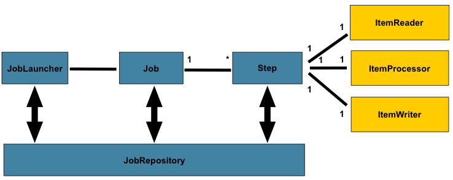
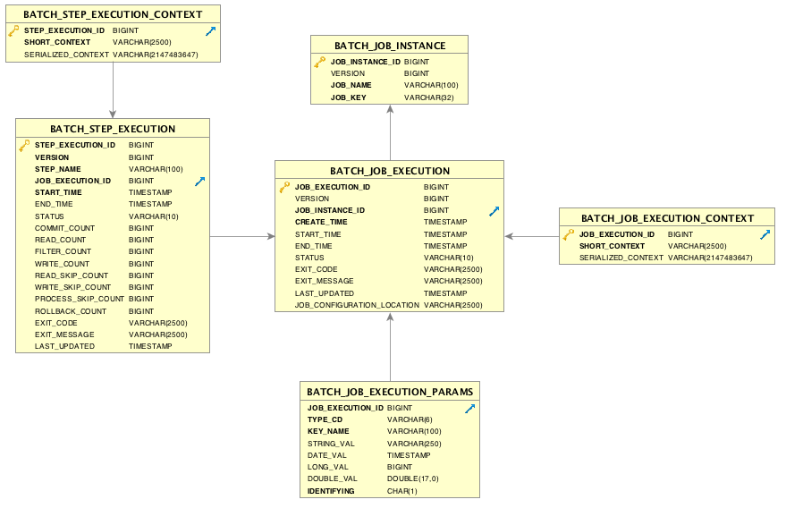

### DevPro 2.0 - devpro-batch-starter 소개
---

devpro-batch-starter 프로젝트는 Spring boot 및 Spring Batch 기반으로 Batch 업무 개발을 빠르게 구축하기 위한 아키텍처 및 
개발 환경, 샘플 코드를 제공하며, 별도의 스케쥴러는 제공하지 않는다(Jenkins 및 Quartz, Cron 등을 활용해서 실행하는 방법 가이드)

### 1. devpro Batch 기본 개요 

* **JobLauncher**  
  JobLauncher는 Job과 Parameter를 받아서 Batch Job을 실행시키는 역할 담당한다.
* **JobParameter**  
  Batch Job에서 사용하는 파라미터이다.
* **JobInstance**  
  논리적인 Job 실행이며, Job과 JobParameter로 구성된다.
* **JobExecution**  
  한번 실행되는 Job으로 시작시간, 종료시간 ,상태(시작됨,완료,실패), 종료상태 등의 정보를 가진다.
* **JobRepository**  
  수행되는 Job에 대한 정보를 담고 있는 저장소로 Job이 수행 시작, 종, 수행 회수, 수행 결과 등 Batch 수행과 관련된 정보가 저장되어 있다.
* **Step**  
  Batch job을 구성하는 단계이며 Job은 하나 이상의 Step으로 구성 되어야 한다. <u>배치 처리 및 제어에 필요한 모든 과정을 정의하는 것으로 비즈니스 개발을 위해 개발자가 직접 정의한다.</u>
* **Step Execution**  
  한번 실행되는 Step으로 시작시간, 종료시간, 상태, 종료상태, commitCount, itemCount의 정보를 가진다.
* **Item**  
  처리할 데이터의 가장 작은 구성 요소이다.(파일의 한 라인, DB의 한 Row)
* **ItemReader**  
  File 및 DB로부터 데이터(Item) 읽어온다. 더 이상 데이터가 없으면 null값을 리턴한다. <u>Config 파일내에서 reader() 메소드를 구현하거나 Custom 클래스를 작성하여 구현한다.</u>
* **ItemWriter**  
  File 및 DB에 데이터를 저장한다. <u>Config 파일내에서 reader() 메소드를 구현하거나 Custom 클래스를 작성하여 구현한다.</u>

* **ItemProcessor**  
  ItemReader에서 읽어 들인 데이터에 대해 비즈니스 로직을 구현한다.
  
### 2. Data Modeling

  
### 3. 프로젝트 빌드 및 실행 
* 프로젝트의 라이브러리, 의존성은 Maven을 통해 관리하며, Maven (또는 Maven Wrapper) 및 IDE에서 빌드를 수행한다.

#### 3.1 이클립스 환경 
* 이클립스에서 빌드 및 실행 
    1. [Run] > [Run Configuration] 을 통해 설정 창 Open 
    2. [Spring Boot] 탭에서 프로파일 설정. 로컬에서 수행시 'local' 로 입력 
    3. [Argumemts] 탭에서 실행할 Job 이름과 파라미터를 입력
    4. Apply 버튼 클릭 후 Run 버튼 클릭하면 실행 

#### 3.2 터미널 환경 (로컬 개발) 
* 터미널 환경에서 Maven 을 통해 빌드하고, Java 를 통해 실행한다.

  * Maven이 설치된 경우, 빌드 명령어

        mvn -Dmaven.test.skip=true clean package 
    
  * 설치가 안되어 있는 경우, 빌드 명령어 (리눅스 계열) 
 
        ./mvnw -Dmaven.test.skip=true clean package

  * 설치가 안되어 있는 경우, 빌드 명령어 (윈도우 계열) 

        mvnw.cmd -Dmaven.test.skip=true clean package
* *target* 디렉토리에 jar 파일 생성 여부 확인 후 실행 
* target 디렉토리에 가서 jar 파일 실행 ( 프로파일, 잡, 파라미터를 인자로 넘겨야 함)
* java -jar -Dspring.profiles.active=local <실행JAR> <Job> <ParamKey:ParamValue>
  
    java -jar -Dspring.profiles.active=local devpro-batch-starter-0.0.1-SNAPSHOT.jar file2dbJob input.file.path:airport_list.csv
    
#### 3.3 서버 환경 (운영서버, 스테이징 서버, 테스트 서버) 
* bin/run.sh 을 프로젝트에 맞게 작성하여, 배포될 때 함께 배포 한다.

     java -jar -Dspring.profiles.active=<프로파일명> 파일명(jar) 

* 배치 실행시 run.sh 을 통해 실행.

    ./run.sh <작업> <파라미터명1>:<파라미터값1> <파라미터명2>:<파라미터값2>
 

### 4. 샘플 코드 설명
#### DB to DB Job
샘플 코드는 **TMP_USER** 테이블의 데이터를 읽어서 **SAMPLE_USER** 테이블에 저장하는 것으로 단일 Step로 구성된 간단한 예제이다.

 * **샘플 소스 코드 패키지 경로** : com.ktds.devpro.batch.job.sample.db2db
 
#### File to DB Job 
 샘플 코드는 전세계의 공항정보가 있는 파일(**airport_list.csv**)로부터 국제공항만(International Airport)만 DB(**AIRPORT_CD**)로 저장하는 
 예제로 필터링 등의 가공을 처리는 하는 과정을 포함한다.
 * Tasklet 과 Chunk 두 개의 Step 으로 이루어짐
 * Listener 와 Exception 사용법이 포함됨
 * **샘플 소스 코드 패키지 경로** : com.ktds.devpro.batch.job.sample.db2db

